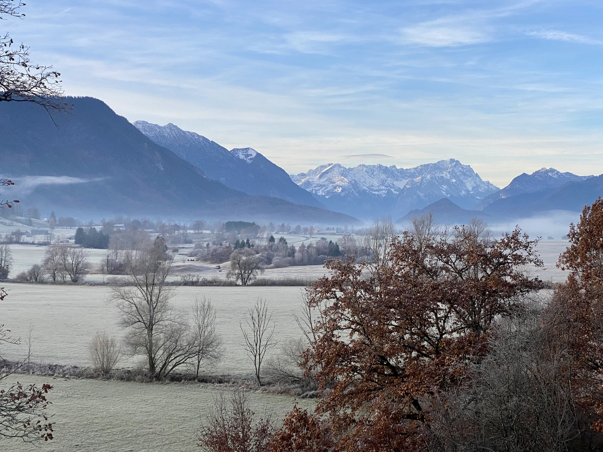

### Hi there 👋, I'm Harry.

I am a passionate software craftsman that loves to code and always experiments with new technologies, frameworks and all other kinds of interesting tools.

- 💬 Ask me about:
     - Observability platforms such as [New Relic](https://www.newrelic.com)
     - Developer-first security platforms such as [Snyk](https://snyk.io/)
     - [Dapr](https://dapr.io/) (Distributed Application Runtime)
     - [Azure](https://azure.microsoft.com/en-us/), [AWS](https://aws.amazon.com/) and [GCP](https://cloud.google.com/)
     - [Zugspitz Region](https://www.zugspitz-region.de/) (see picture above) and [Greater Munich Metro region](https://www.metropolregion-muenchen.eu/)
- 📫 How to reach me:
     - Twitter: [https://twitter.com/harrykimpel](https://twitter.com/harrykimpel)
     - Mastodon: <a rel="me" href="https://hachyderm.io/@harrykimpel">https://hachyderm.io/@harrykimpel</a>
     - Website: https://www.kimpel.com

